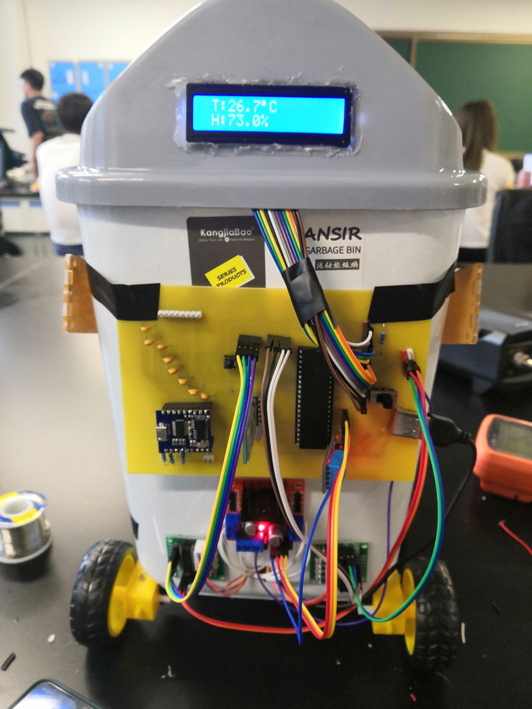

# 基于51单片机的创意机器人项目

这是我在大学生产实习创新实践过程中做的一款创意机器人，它是以51单片机为基础，设计了运动，环境信息检测，语音互动，机器人挥手，蓝牙控制等几大功能。虽然网上也有很多相类似的方案和设计，但我还是考虑将其分享出来给大家参考下。一方面，我的设计内容也参考了许多的经验分享，没有他们的帮助，我不可能在有限的时间内做好这个项目，这种行为应该被接力下去；另一方面，我认为这个项目做的还是很扎实的，程序我也有用心写，写的很好懂，没有多余的bug，如果能得到各位的认可，确实是一件非常有成就感的事情。欢迎和我一起交流探讨。

## 功能介绍-运动

选用了L298N驱动模块+普通减速马达，可以实现前进，后退，左右转弯的功能，可用手机蓝牙软件控制。

## 功能介绍-环境信息检测

选用了DHT11温湿度传感器，通过单线双向串行接口与单片机实现通讯，可以检测环境温度和湿度数据，并通过液晶显示屏显示出来。

## 功能介绍-机器人挥手

选用了步进电机和配套ULN2003步进电机扩展版，通过手机蓝牙发送指令控制电机转动，可做出上下挥手的动作。

## 功能介绍-语音交互

选用了一款集成度比较高的语音识别模块，LD3320这部分主要是我同学负责完成的，据我了解这个模块已经做好了一套单片机系统，商家也有提供参考代码，根据自己的需求在它的代码上做修改就好。

## 参考资料

详细的元器件清单在这里：链接：https://pan.baidu.com/s/1SK91G157tQt-f0vSRgIzmw?pwd=itzs 
提取码：itzs

PCB热转印原理图：链接：https://pan.baidu.com/s/100OBSqIFcOEytHc1fRL7KA?pwd=itzs 
提取码：itzs

其他的一些硬件参考资料：链接：https://pan.baidu.com/s/1oKts2k1LMSfozumXk7MrwA?pwd=itzs 
提取码：itzs（网上也可以查得到）

